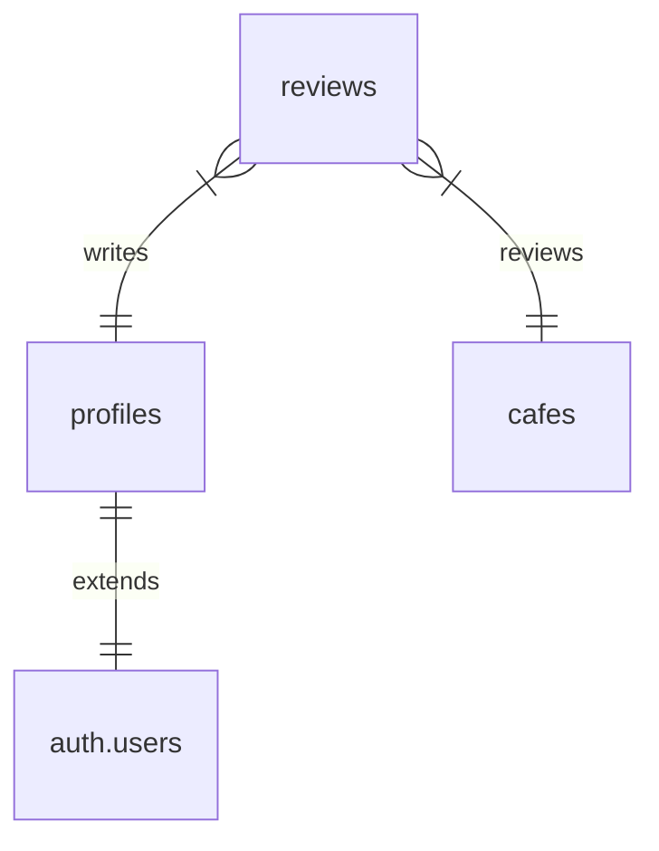

# Berkeley Brew Database Documentation

## Overview
Berkeley Brew uses Supabase (PostgreSQL) as its database. The schema is designed to support cafe listings, user reviews, and user profiles.

## Tables

### profiles
Extends Supabase authentication to store additional user information.

| Column      | Type        | Constraints           | Description                    |
|-------------|-------------|----------------------|--------------------------------|
| id          | uuid        | PRIMARY KEY          | Links to auth.users           |
| username    | text        | UNIQUE               | User's display name           |
| created_at  | timestamptz | DEFAULT NOW()        | Profile creation timestamp    |

### cafes
Stores information about coffee shops.

| Column      | Type        | Constraints           | Description                    |
|-------------|-------------|----------------------|--------------------------------|
| id          | uuid        | PRIMARY KEY          | Unique identifier             |
| name        | text        | NOT NULL             | Cafe name                     |
| address     | text        | NOT NULL             | Physical address              |
| created_at  | timestamptz | DEFAULT NOW()        | Record creation timestamp     |
| updated_at  | timestamptz | DEFAULT NOW()        | Last update timestamp         |

### reviews
User reviews and ratings for cafes.

| Column      | Type        | Constraints           | Description                    |
|-------------|-------------|----------------------|--------------------------------|
| id          | uuid        | PRIMARY KEY          | Unique identifier             |
| cafe_id     | uuid        | FOREIGN KEY          | References cafes.id           |
| user_id     | uuid        | FOREIGN KEY          | References auth.users.id      |
| content     | text        | NOT NULL             | Review text                   |
| rating      | numeric(2,1)| CHECK (0-5)          | Overall rating (0-5 stars)    |
| created_at  | timestamptz | DEFAULT NOW()        | Review creation timestamp     |

## Relationships



## Row Level Security (RLS) Policies

### profiles
- SELECT: Public read access
- INSERT: Users can create their own profile
- UPDATE: Users can update their own profile

### cafes
- SELECT: Public read access

### reviews
- SELECT: Public read access
- INSERT: Authenticated users can create reviews
- UPDATE: Users can update their own reviews

## Future Considerations

Consider adding:
1. Cafe attributes:
   - Operating hours
   - WiFi availability
   - Study space rating
   - Noise level
   - Power outlet availability

2. Photos:
   - Cafe photos
   - User-submitted photos

3. Real-time data:
   - Current occupancy
   - Wait times
   - Special events

## Development Guidelines

1. **Schema Changes**
   - Document all changes in this file
   - Test changes locally before deploying
   - Update types in `packages/types/db/`

2. **Data Types**
   - Use `uuid` for IDs
   - Use `timestamptz` for timestamps
   - Use appropriate numeric precision

3. **Security**
   - Always consider RLS policies
   - Test access patterns
   - Validate input data

## Setting Up Locally

1. Create a Supabase project
2. Run the schema file:
   ```bash
   # From packages/api/src/db/
   supabase db reset
   ```
3. Verify table creation
4. Test RLS policies
